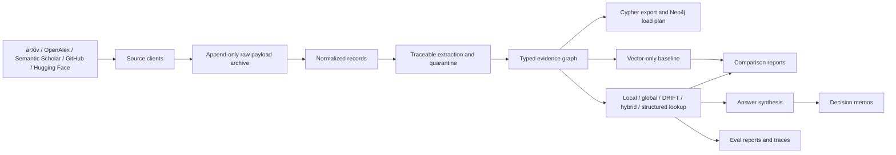

# SignalGraph

SignalGraph is an engine-first GraphRAG system for AI teams comparing research ideas, repositories, methods, benchmarks, datasets, models, and claims before adoption decisions.

The operating surface is a Python package and CLI, Neo4j Browser-compatible Cypher, Markdown decision memos, JSON/CSV eval artifacts, and local trace files. There is no custom web application in this repository.

## Product Loop

SignalGraph answers relationship-heavy engineering questions:

- Which papers introduce or use a method?
- Which repositories appear to implement those methods?
- What claims and source spans support a recommendation?
- What evidence is missing before adoption?
- Where does graph-aware retrieval beat vector-only retrieval?

The included corpus and evals focus on AI agent memory, GraphRAG, Text2Cypher, hybrid retrieval, and RAG evaluation.

## Architecture



Implemented graph nodes include papers, authors, organizations, repositories, repo documents, releases, issues, methods, claims, chunks, benchmarks, datasets, models, and communities. Relationships include typed evidence links such as `AUTHORED_BY`, `INTRODUCES`, `USES_METHOD`, `IMPLEMENTS`, `CLAIMS`, `SUPPORTED_BY`, `EVALUATES_ON`, `BELONGS_TO_COMMUNITY`, `SIMILAR_TO`, `CITES`, `CONTRADICTS`, and reviewable `POSSIBLE_DUPLICATE` edges.

## Setup

SignalGraph runs local checks with the Python standard library. Credentials, network access, and a live Neo4j instance are optional.

```bash
cd /Users/nikolacehic/Desktop/SignalGraph
python3 -m pip install -e .
signalgraph --help
```

Without installation:

```bash
PYTHONPATH=src python3 -m signalgraph.cli --help
```

Optional environment variables:

- `GITHUB_TOKEN` improves GitHub rate limits.
- `OPENALEX_MAILTO` identifies OpenAlex requests.
- `SEMANTIC_SCHOLAR_API_KEY` or `S2_API_KEY` improves Semantic Scholar rate limits.
- `HUGGINGFACE_TOKEN` or `HF_TOKEN` improves Hugging Face rate limits.
- `NEO4J_URI`, `NEO4J_USER`, `NEO4J_PASSWORD`, and `NEO4J_DATABASE` are used only when running `graph load-neo4j --execute`.

## CLI Transcript

These commands run against the bundled deterministic corpus and do not require credentials, network, or Neo4j:

```bash
signalgraph ingest run --topic "GraphRAG agent memory" --sample
# Ingestion complete
# papers: ...
# repos: ...
# repo_documents: ...
# repo_releases: ...
# repo_issues: ...
# claims: ...

signalgraph graph build
# Graph artifact built
# nodes: ...
# edges: ...
# graph_json: .../artifacts/graph/signalgraph_graph.json
# cypher_export: .../artifacts/cypher/signalgraph_export.cypher
# evidence_queries: .../artifacts/cypher/evidence_path_queries.cypher

signalgraph graph communities --limit 3
# Community reports generated
# community_reports_json: .../artifacts/graph/community_reports.json

signalgraph graph structured-lookup --query "Which repos implement papers after 2024?"
# mode: structured_lookup
# cypher_template: structured_repo_lookup
# results:

signalgraph ask --mode drift "Which GraphRAG implementation should a startup evaluate first?"
# route: drift
# confidence: ...
# citations:
# evidence_paths:
# production_recommendation: ...

signalgraph compare "Compare GraphRAG and Text2Cypher for enterprise support automation."
# vector_only:
# graph_rag:
# metrics:

signalgraph eval corpus
# questions: 70
# categories:

signalgraph eval run
# questions: 70
# rows: 420
# ablations: vector-only, hybrid, local, global, DRIFT-style, best-route
# graph_metrics:

signalgraph report decision-memo --query "Which GraphRAG implementation should a startup evaluate first?"
# Decision memo generated

signalgraph report eval-summary
# Eval summary generated
```

## Data Sources

Implemented public clients:

- arXiv public API for paper metadata.
- OpenAlex public API for works, authorship, institutions, citation counts, and abstract inverted indexes.
- Semantic Scholar Graph API for papers, authors, references, and citations.
- GitHub REST API for repository metadata, README/docs/changelog content, selected releases, selected issues, topics, license, freshness, and repo-risk signals.
- Hugging Face Hub APIs for model and dataset metadata/cards.

Raw storage records preserve source name, source URL, source ID, fetch time, request params, response hash, raw payload path, terms note, freshness policy, rate-limit note, cache policy/status, and quality-gate status.

## Extraction And Quality

Traceable extraction creates method, benchmark, dataset, and claim records from abstracts, repo docs, release notes, issue text, and model/dataset cards. Claims require source spans before entering the graph; invalid or untraceable extraction output is written to quarantine records.

Entity resolution records exact, probable, and possible-duplicate decisions. Exact/probable states can influence Local Search anchoring; possible duplicates remain review signals and are exposed through `POSSIBLE_DUPLICATE` edges and saved Cypher.

Source quality scoring distinguishes API metadata, paper text, official repo README/docs, releases, issues, model/dataset cards, and inferred claims. Ranking and answer synthesis consume those scores.

## Retrieval Modes

SignalGraph includes:

- Vector-only baseline over source-addressable chunks and claims.
- Local Search over entity-resolution-aware graph neighborhoods with chunks, claims, community pull-in, reranking, and evidence paths.
- Global Search over generated community reports.
- DRIFT-style broad-to-local retrieval with generated subquestions and answer-tree ranking.
- Hybrid retrieval with vector similarity, full-text/exact matching, graph traversal, Reciprocal Rank Fusion, MMR diversity, and graph path scoring.
- Structured lookup backed by inspectable Cypher templates.

Answers include a direct answer, reasoning, citations, evidence chain, confidence, conflicts or missing evidence, production recommendation, and next checks.

## Neo4j Inspection

Neo4j support is optional and artifact-oriented by default:

```bash
signalgraph graph load-neo4j --dry-run
signalgraph graph cypher-template
signalgraph graph cypher-template --name evidence_path
```

Generated files:

- `artifacts/cypher/signalgraph_export.cypher` contains constraints, indexes, node loads, relationship loads, and vector/full-text index declarations.
- `artifacts/cypher/evidence_path_queries.cypher` contains Neo4j Browser-ready queries for evidence paths, structured repo lookup, counts, community evidence, conflicts, and duplicate review.

To load a local Neo4j instance:

```bash
docker compose up -d neo4j
signalgraph graph load-neo4j --execute
```

The test suite and local verification do not require the live load path.

## Evals And Reports

`signalgraph eval run` uses a 70-question corpus across entity-specific, comparison, broad landscape, structured, decision-memo, and adversarial/uncertainty categories. It runs six ablations: vector-only, hybrid, local, global, DRIFT-style, and best-route.

Metrics include faithfulness, answer relevance, context precision, context recall, graph path recall, evidence-chain completeness, citation accuracy, conflict awareness, latency, cost estimate, required node recall, required edge recall, path validity, provenance coverage, merge quality, and staleness detection.

Generated examples in this repository:

- `reports/decision_memos/which-graphrag-implementation-should-a-startup-evaluate-first.md`
- `reports/eval_summary.md`
- `reports/retrieval_quality.md`
- `reports/generation_quality.md`
- `reports/system_health.md`
- `reports/failure_cases.md`
- `artifacts/eval_results.json`
- `artifacts/retrieval_comparison.csv`
- `artifacts/traces/eval_query_traces.jsonl`
- `artifacts/traces/query_traces.jsonl`

## Tradeoffs

- The default runtime favors deterministic local checks over external evaluator services, paid model calls, or live database dependencies.
- The bundled corpus is compact so graph paths, claims, and eval failures are inspectable by hand.
- Public API clients are implemented, but local tests use fixtures to avoid network and credential requirements.
- Neo4j loading is available, while the default verification path uses generated Cypher and dry-run plans.
- The extraction and scoring layers are deterministic by default; provider adapters exist where a team wants to add model-backed extraction behind validation and quarantine.

## Failure Cases

SignalGraph records failure and uncertainty instead of hiding it:

- Overconfident adoption claims are reduced when citations, source spans, repo-health signals, or benchmark evidence are weak.
- Stale repository evidence affects retrieval/eval scores.
- Possible duplicate entities remain reviewable instead of being merged as facts.
- Unsupported or untraceable extracted claims are quarantined.
- Eval reports include failure-case Markdown, CSV, JSON, and trace artifacts.

## Expansion Path

Useful next increments are operational rather than required for the current local engine: run larger bounded public-data pulls, tune entity-resolution thresholds on a larger corpus, exercise live Neo4j loading in a managed environment, add external tracing/evaluator integrations, and review generated failure cases with domain experts.
